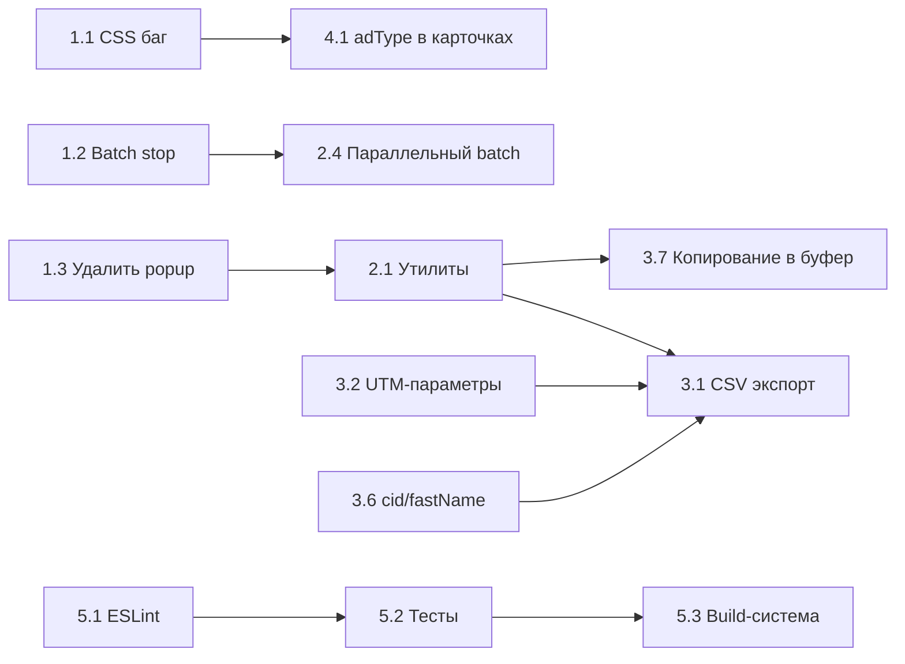

# Yandex Ads Scraper — План улучшений

## Обзор проекта

Chrome-расширение (Manifest V3) для сбора рекламных объявлений со страниц поиска Яндекса.
Состоит из: `background.js` (service worker), `content.js` (парсер DOM), `sidepanel.js/html/css` (основной UI), `popup.js/html/css` (устаревший UI).

---

## Фаза 1: Критические баги

### 1.1 Исправить CSS синтаксическую ошибку в sidepanel.css
- **Файл:** `sidepanel.css:248`
- **Проблема:** Лишняя `}` после правила `.session-count-badge` ломает весь CSS ниже
- **Действие:** Удалить лишнюю закрывающую скобку

### 1.2 Реализовать остановку batch-сбора
- **Файл:** `background.js`, `sidepanel.js`
- **Проблема:** `stopBatch()` отправляет `batchStop`, но `background.js` не обрабатывает это сообщение — цикл продолжает выполняться
- **Действие:**
  - Добавить флаг `batchAborted` в `background.js`
  - Обработать сообщение `batchStop` — установить флаг
  - Проверять флаг в цикле `runBatchScrape()` перед каждой итерацией
  - Отправлять `batchDone` с пометкой `aborted: true`

### 1.3 Удалить мёртвый код popup
- **Файлы:** `popup.js`, `popup.html`, `popup.css`
- **Проблема:** При клике на иконку открывается side panel — popup недоступен, весь код мёртвый
- **Действие:**
  - Удалить `popup.js`, `popup.html`, `popup.css`
  - Убрать ссылку на popup из `manifest.json` (если есть)
  - Убрать `popup.js` из `manifest.json` если он там подключён

---

## Фаза 2: Архитектура и стабильность

### 2.1 Вынести общий код в утилиты
- **Проблема:** `formatUrl()`, `downloadJSON()`, `removeHighlights()` дублируются в popup.js и sidepanel.js
- **Действие:**
  - Создать `utils.js` с общими функциями
  - Подключить в `sidepanel.html` через `<script src="utils.js">`
  - Удалить дубликаты из sidepanel.js

### 2.2 Поддержка yandex.ru в batch-режиме
- **Файл:** `background.js:76`
- **Проблема:** Захардкожен `ya.ru` в `scrapeQuery()`
- **Действие:**
  - Добавить настройку выбора домена (ya.ru / yandex.ru)
  - Использовать настройку в `scrapeQuery()`
  - Сохранять выбор в `chrome.storage.local`

### 2.3 Ограничения batch-режима
- **Проблема:** Нет лимита на количество запросов — можно отправить 1000 и положить браузер
- **Действие:**
  - Лимит 50 запросов на batch
  - Показывать предупреждение при превышении
  - Валидация textarea на пустые строки и дубликаты

### 2.4 Параллельный batch с ограничением concurrency
- **Файл:** `background.js`
- **Проблема:** Вкладки открываются последовательно — медленно
- **Действие:**
  - Реализовать пул из 3 параллельных вкладок
  - Добавить задержку 1-2 секунды между открытием вкладок (rate limiting)
  - Сохранять возможность последовательного режима

### 2.5 Проверка лимита chrome.storage.local
- **Проблема:** Лимит 10MB — нет проверки перед сохранением
- **Действие:**
  - Проверять `chrome.storage.local.getBytesInUse()` перед сохранением
  - Показывать предупреждение при приближении к лимиту
  - Предлагать очистить старые сессии

---

## Фаза 3: Функциональные улучшения

### 3.1 Экспорт в CSV
- **Проблема:** Только JSON — аналитикам нужен CSV для Excel
- **Действие:**
  - Добавить кнопку «Скачать CSV» рядом с «Скачать JSON»
  - Формат: столбцы title, url, description, adType, position, additionalLinks, searchQuery, timestamp
  - Кодировка UTF-8 с BOM для корректного открытия в Excel

### 3.2 Парсинг UTM-параметров в отдельные поля
- **Проблема:** URL сохраняется целиком, но UTM-параметры не разбираются
- **Действие:**
  - В `extractAdData()` добавить блок `utmParams`:
    ```json
    "utmParams": {
      "utm_source": "yandex",
      "utm_medium": "cpc",
      "utm_campaign": "707348178",
      "utm_content": "17608791693",
      "utm_term": "натяжные потолки москва"
    }
    ```
  - Извлекать из URL через `URLSearchParams`
  - Включать в JSON и CSV экспорт

### 3.3 Поиск и фильтрация по собранным объявлениям
- **Проблема:** Нет поиска — при большом количестве сессий сложно найти нужное
- **Действие:**
  - Добавить строку поиска над списком сессий
  - Фильтрация по: заголовок, URL, поисковый запрос
  - Фильтр по типу: спецразмещение / гарантия / бизнес

### 3.4 Дедупликация сессий
- **Проблема:** Повторный сбор того же запроса создаёт дубликат сессии
- **Действие:**
  - При добавлении сессии проверять: есть ли сессия с таким же `query`
  - Предлагать: заменить / добавить / пропустить
  - Или автоматически обновлять существующую с сохранением истории

### 3.5 Восстановление парсинга Яндекс.Бизнес
- **Файл:** `content.js:101-106`
- **Проблема:** Парсинг карточек организаций закомментирован
- **Действие:**
  - Протестировать текущие селекторы на реальных страницах
  - Обновить селекторы при необходимости
  - Раскомментировать и включить в `findAdBlocks()`

### 3.6 Извлечение cid и fastName
- **Файл:** `content.js`
- **Проблема:** Поля `rawAttributes` в JSON не заполняются
- **Действие:**
  - Извлекать `data-cid` из атрибута элемента
  - Извлекать `data-fast-name` из атрибута элемента
  - Включать в `extractAdData()`

### 3.7 Копирование JSON в буфер обмена
- **Проблема:** Нет быстрого способа скопировать данные
- **Действие:**
  - Добавить кнопку «Копировать JSON» рядом с «Скачать JSON»
  - Использовать `navigator.clipboard.writeText()`
  - Показывать подтверждение «Скопировано!»

---

## Фаза 4: UI/UX улучшения

### 4.1 Показывать adType в карточках sidepanel
- **Файл:** `sidepanel.js:321`
- **Проблема:** `createAdItem()` не показывает тип объявления
- **Действие:**
  - Добавить цветной бейдж: зелёный — спецразмещение, синий — гарантия, оранжевый — бизнес
  - Аналогично тому как сделано в popup.js `createAdItem()`

### 4.2 Показывать description и sitelinks в карточках
- **Файл:** `sidepanel.js:321`
- **Проблема:** Только title и url — без описания и уточнений
- **Действие:**
  - Добавить описание под заголовком (серый текст, 2 строки max)
  - Добавить sitelinks как мелкие ссылки под описанием

### 4.3 Подтверждение удаления
- **Проблема:** `clearAll()` и `deleteSession()` без confirm-диалога
- **Действие:**
  - Добавить модальный диалог подтверждения
  - «Удалить все сессии? Это действие нельзя отменить.»
  - Кнопки «Удалить» / «Отмена»

### 4.4 Информация о версии в UI
- **Проблема:** В UI не отображается версия расширения
- **Действие:**
  - Читать версию из `chrome.runtime.getManifest().version`
  - Показывать мелким текстом внизу sidepanel

### 4.5 Индикация ошибок в batch
- **Проблема:** Не видно какие запросы завершились ошибкой
- **Действие:**
  - В batch-результатах показывать ошибки красным
  - Счётчик: «5 успешно, 2 с ошибкой»
  - Возможность скачать отчёт об ошибках

---

## Фаза 5: Качество и DevOps

### 5.1 Настроить ESLint + Prettier
- **Действие:**
  - `npm init -y`
  - `npm install -D eslint prettier eslint-config-prettier`
  - Настроить `.eslintrc.json` и `.prettierrc`
  - Добавить скрипты `lint` и `format` в `package.json`

### 5.2 Unit-тесты для YandexAdParser
- **Действие:**
  - `npm install -D jest`
  - Создать моки DOM с HTML-фрагментами Яндекса
  - Покрыть тестами: `findAdBlocks()`, `isAdvertisement()`, `getAdType()`, `extractAdData()`, `extractUrl()`, `extractSitelinks()`
  - Добавить скрипт `test` в `package.json`

### 5.3 Build-система
- **Действие:**
  - Выбрать: Vite или Rollup
  - Минификация JS/CSS для production
  - Автоматическая генерация `manifest.json` с версией из `package.json`
  - Скрипты: `dev` (watch), `build` (production)

---

## Диаграмма зависимостей



---

## Рекомендуемый порядок реализации

1. **Фаза 1** — критические баги, блокируют дальнейшую работу
2. **Фаза 2.1** — утилиты, устраняет дублирование перед добавлением нового кода
3. **Фаза 3.1 + 3.2** — CSV + UTM, самая востребованная функциональность
4. **Фаза 4.1 + 4.2** — улучшение отображения в sidepanel
5. **Фаза 2.2-2.5** — стабильность batch-режима
6. **Фаза 3.3-3.7** — остальные функциональные улучшения
7. **Фаза 4.3-4.5** — оставшиеся UI улучшения
8. **Фаза 5** — качество кода и DevOps
